# Vector Database

## What Is a Vector Database?

A **vector database** is a specialized type of database designed to store and query **high-dimensional vectors** — typically embeddings generated from unstructured data like text, images, or audio.

Think of it as a search engine for meaning or similarity, rather than exact matches.

## Why Do We Need It?

In modern applications — think **semantic search**, **recommendation systems**, **LLM-based retrieval (RAG)** — you need to find “things like this thing.” That’s fundamentally different from relational DBs, which are great at exact matches, filters, and joins.

For example:

- Traditional SQL: “Find product with ID = 123”
- Vector DB: “Find products _similar_ to this product based on description”

## Key Concepts

### Vectors / Embeddings

- A **vector** is just a list of numbers (e.g., `[0.1, -0.3, ..., 0.05]`), often 128-1536 dimensions.
- Generated using models like OpenAI, Hugging Face Transformers, or CLIP for images.

### Similarity Search

- Vector DBs use **distance metrics** (cosine, Euclidean, dot product) to find nearest neighbors.
- “Nearest” = most semantically similar.

### Approximate Nearest Neighbor (ANN)

- Brute-force search is expensive in high dimensions (curse of dimensionality).
- ANN algorithms like **HNSW**, **FAISS**, **IVF**, and **ScaNN** make it scalable by trading off a bit of accuracy for speed.

### Indexing

- Vectors are indexed using tree structures or graphs for fast retrieval.
- Many databases support re-indexing or hybrid search (vector + keyword).

## Architecture (Simplified)

```mermaid
graph LR
    A[User Search Query] --> B(Neural Search Plugin);
    B --> C(Text Embedding Model);
    C -- Converts Query to Vector --> D[Query Vector Embedding];
    D --> E(k-NN Plugin);
    E -- Searches Vector Index --> F["Vector Index (Document Embeddings)"];
    F -- Finds Nearest Neighbors --> G[Relevant Document Vectors];
    G --> H(Neural Search Plugin);
    H -- Retrieves Original Documents --> I[Relevant Search Results];
    I --> J[User];

    subgraph Indexing Process
        K[Document] --> L(Ingest Pipeline);
        L --> M(Text Embedding Processor);
        M -- Converts Document to Vector --> N[Document Vector Embedding];
        N --> F;
    end

    style F stroke:#333,stroke-width:2px
    style E stroke:#333,stroke-width:2px
    style C stroke:#333,stroke-width:2px
```



## Common Use Cases

- **RAG (Retrieval Augmented Generation)**: Combine LLMs with relevant data fetched from a vector DB.
- **Semantic Search**: Search based on meaning, not keywords.
- **Personalized Recommendations**
- **Anomaly Detection**: Find “outliers” in vector space.
- **Image/audio similarity search**

## Vector DBs in the Wild

| DB           | Key Traits                                            |
| ------------ | ----------------------------------------------------- |
| **Pinecone** | Fully managed, fast, easy to use                      |
| **Weaviate** | Open-source, includes semantic schema & hybrid search |
| **Qdrant**   | Open-source, Rust-based, efficient ANN                |
| **Milvus**   | High-performance, supports billion-scale vectors      |
| **FAISS**    | Facebook’s lib for ANN, used in many DIY solutions    |

## API Design (Typical Pattern)

```python
# Insert
client.insert([
    {
        "id": "doc1",
        "vector": [0.1, 0.2, ..., 0.05],
        "metadata": {"title": "Intro to ML"}
    }
])

# Query
results = client.query(
    vector=query_vector,
    top_k=5,
    filter={"category": "ML"}
)
```

## Integration Tips

- Use **caching** for frequently queried vectors.
- Combine vector search with **keyword filtering** for hybrid search.
- Keep metadata in sync if using a separate relational DB.
- Tune ANN parameters for the right **accuracy/speed** tradeoff.

## TL;DR for Engineers

- Vector DBs = Search by **meaning**, not exact match.
- Use when dealing with **unstructured data** (text, images, etc.).
- Embeddings → Stored in Vector DB → Queried via ANN.
- Excellent for LLM-based apps, search, recommendation systems.
- Plug into your stack like any other DB, but with an extra pre-processing step (embedding generation).
