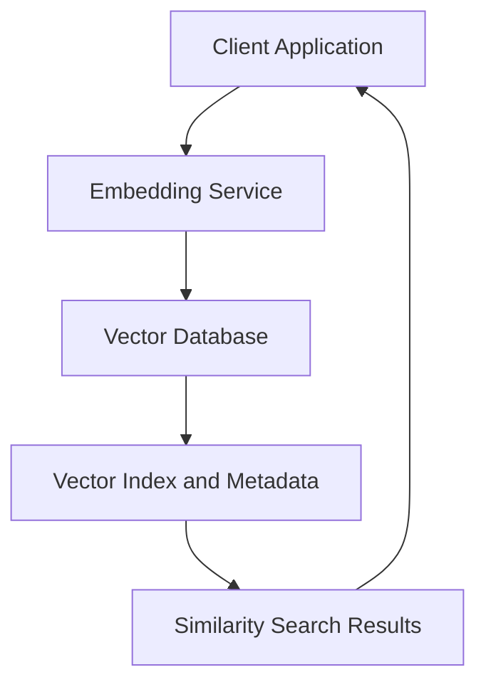

# Vector Database

## What Is a Vector Database?

A **vector database** is a specialized type of database designed to store and query **high-dimensional vectors** — typically embeddings generated from unstructured data like text, images, or audio.

Think of it as a search engine for meaning or similarity, rather than exact matches.

## Why Do We Need It?

In modern applications — think **semantic search**, **recommendation systems**, **LLM-based retrieval (RAG)** — you need to find “things like this thing.” That’s fundamentally different from relational DBs, which are great at exact matches, filters, and joins.

For example:

- Traditional SQL: “Find product with ID = 123”
- Vector DB: “Find products _similar_ to this product based on description”

## Key Concepts

### Vectors / Embeddings

- A **vector** is just a list of numbers (e.g., `[0.1, -0.3, ..., 0.05]`), often 128-1536 dimensions.
- Generated using models like OpenAI, Hugging Face Transformers, or CLIP for images.

### Similarity Search

- Vector DBs use **distance metrics** (cosine, Euclidean, dot product) to find nearest neighbors.
- “Nearest” = most semantically similar.

### Approximate Nearest Neighbor (ANN)

- Brute-force search is expensive in high dimensions (curse of dimensionality).
- ANN algorithms like **HNSW**, **FAISS**, **IVF**, and **ScaNN** make it scalable by trading off a bit of accuracy for speed.

### Indexing

- Vectors are indexed using tree structures or graphs for fast retrieval.
- Many databases support re-indexing or hybrid search (vector + keyword).

## Architecture (Simplified)



## Common Use Cases

- **RAG (Retrieval Augmented Generation)**: Combine LLMs with relevant data fetched from a vector DB.
- **Semantic Search**: Search based on meaning, not keywords.
- **Personalized Recommendations**
- **Anomaly Detection**: Find “outliers” in vector space.
- **Image/audio similarity search**

## Vector DBs in the Wild

| DB           | Key Traits                                            |
| ------------ | ----------------------------------------------------- |
| **Pinecone** | Fully managed, fast, easy to use                      |
| **Weaviate** | Open-source, includes semantic schema & hybrid search |
| **Qdrant**   | Open-source, Rust-based, efficient ANN                |
| **Milvus**   | High-performance, supports billion-scale vectors      |
| **FAISS**    | Facebook’s lib for ANN, used in many DIY solutions    |

## API Design (Typical Pattern)

```python
# Insert
client.insert([
    {
        "id": "doc1",
        "vector": [0.1, 0.2, ..., 0.05],
        "metadata": {"title": "Intro to ML"}
    }
])

# Query
results = client.query(
    vector=query_vector,
    top_k=5,
    filter={"category": "ML"}
)
```

## Integration Tips

- Use **caching** for frequently queried vectors.
- Combine vector search with **keyword filtering** for hybrid search.
- Keep metadata in sync if using a separate relational DB.
- Tune ANN parameters for the right **accuracy/speed** tradeoff.

## TL;DR for Engineers

- Vector DBs = Search by **meaning**, not exact match.
- Use when dealing with **unstructured data** (text, images, etc.).
- Embeddings → Stored in Vector DB → Queried via ANN.
- Excellent for LLM-based apps, search, recommendation systems.
- Plug into your stack like any other DB, but with an extra pre-processing step (embedding generation).

## Embedding Input Modalities & Their Applications

| **Modality**                  | **Description**                               | **Problems Solved**                                       | **Example Use Cases**                                  | **Example Embedding Models**          |
| ----------------------------- | --------------------------------------------- | --------------------------------------------------------- | ------------------------------------------------------ | ------------------------------------- |
| **Text**                      | Sentences, documents, paragraphs              | Semantic similarity, classification, search, RAG          | Search engines, chat memory, intent classification     | BERT, SBERT, OpenAI ada, Cohere, e5   |
| **Code**                      | Source code snippets, functions, entire files | Code search, clone detection, automated documentation     | GitHub Copilot, StackOverflow search, Code QA          | CodeBERT, GraphCodeBERT, OpenAI codex |
| **Image**                     | Photos, screenshots, drawings                 | Similarity, retrieval, tagging, vision-language alignment | Visual search, auto-tagging, captioning                | CLIP, ResNet, DINO, BLIP              |
| **Audio**                     | Voice clips, music, environmental sounds      | Speaker recognition, classification, retrieval            | Voice assistants, music search, bioacoustics           | Wav2Vec2, YAMNet, OpenL3              |
| **Video**                     | Sequences of frames (with/without audio)      | Action recognition, summarization, similarity             | Sports analysis, surveillance, content moderation      | VideoMAE, ViViT, CLIP-ViT             |
| **Multimodal (Text + Image)** | Joint space for language and vision           | Cross-modal search, captioning, VQA                       | Image captioning, product search ("show me red shoes") | CLIP, BLIP, Flamingo                  |
| **Multimodal (Text + Audio)** | Maps textual prompts and audio                | Sound-to-text alignment, audio search                     | Podcast search, subtitle generation                    | Whisper, CLAP                         |
| **Multilingual Text**         | Text across languages                         | Cross-lingual search, translation evaluation              | Global search, language-agnostic RAG                   | LaBSE, LASER, XLM-R                   |
| **3D Data / Point Clouds**    | Lidar, 3D object meshes                       | Object detection, shape classification                    | Robotics, autonomous vehicles, AR/VR                   | PointNet, DGCNN                       |
| **Time Series / Sensor Data** | Sequences from IoT, financial, health data    | Forecasting, anomaly detection, similarity                | Predictive maintenance, health monitoring              | TS2Vec, InceptionTime                 |
| **Tabular Data**              | Structured rows and columns                   | Classification, semantic joins, anomaly detection         | Fraud detection, semantic search in tables             | TabTransformer, FT-Transformer        |
| **Graphs**                    | Nodes + edges (social, molecular, etc.)       | Node classification, link prediction, clustering          | Social networks, drug discovery                        | Node2Vec, GCN, GraphSAGE              |
| **DNA / Protein Sequences**   | Biological sequences (genomics, proteomics)   | Functional classification, structure prediction           | Drug discovery, gene similarity                        | ESM, ProtBERT, AlphaFold embeddings   |
| **Documents (multi-modal)**   | Embedded combinations: title, body, metadata  | Hybrid retrieval, clustering, semantic linking            | Academic search, RAG pipelines                         | BGE, GTR, ColBERT                     |

### Key Takeaways

- **Text embeddings** dominate many apps, but **multimodal and structured data embeddings** are growing fast, especially in research and ML ops.
- **Multimodal embeddings** open doors for complex AI — e.g., describing an image, searching by sound, or captioning a video.
- **Biological and scientific embeddings** are a hot area in AI for science (e.g., protein folding, molecule similarity).

## Core Query Types in a Vector Database

| **Query Type**                      | **Description**                                                                                               | **Common Use Cases**                                             |
| ----------------------------------- | ------------------------------------------------------------------------------------------------------------- | ---------------------------------------------------------------- |
| **K-Nearest Neighbors (KNN)**       | Returns the top `k` vectors closest to a given query vector using a distance metric (e.g., cosine, Euclidean) | Semantic search, recommendations, RAG                            |
| **Similarity Search**               | Same as KNN, often includes a similarity **threshold** or **distance cutoff**                                 | "Find items similar to X with at least 85% similarity"           |
| **Filtered Search (Hybrid Search)** | Combines vector similarity with structured filters (metadata constraints like category, date, price)          | “Find tech blog posts similar to this one, published after 2021” |
| **Multivector / Batch Search**      | Runs multiple queries at once (e.g., batched queries)                                                         | Multi-document retrieval, LLM context building                   |
| **Score-only Search**               | Returns similarity scores (not just IDs), often for re-ranking or explainability                              | Search result tuning, A/B testing                                |
| **Reverse Lookup**                  | Given a vector, find if it already exists (or close to it) in the index                                       | Deduplication, update logic                                      |
| **Vector Arithmetic / Analogy**     | Perform operations like `vec("king") - vec("man") + vec("woman")`                                             | Word analogy tasks, embeddings reasoning (limited support)       |
| **Upsert / Replace**                | Insert or update a vector and metadata (often atomic)                                                         | Maintaining live index                                           |
| **Delete by ID or Filter**          | Remove vectors by unique ID or matching metadata                                                              | Index pruning, user data deletion                                |
| **Get by ID**                       | Retrieve the vector and/or metadata by document ID                                                            | Use in fallback pipelines or audits                              |

## Specialized / Advanced Query Modes

| **Feature**                     | **Purpose**                                             | Supported by                              |
| ------------------------------- | ------------------------------------------------------- | ----------------------------------------- |
| **Hybrid Ranking**              | Mix of keyword and vector scores                        | Weaviate, Vespa, Elasticsearch            |
| **Payload-aware Search**        | Use metadata to adjust scores or routing                | Qdrant, Weaviate                          |
| **Re-ranking (post retrieval)** | Reorder top-K using another model (e.g., cross-encoder) | Pinecone, LlamaIndex                      |
| **Geo-aware Search**            | Filter or score vectors by proximity AND location       | Milvus, custom pipelines                  |
| **Time-windowed Search**        | Filter vector results based on temporal constraints     | Pinecone (metadata filters), custom logic |
