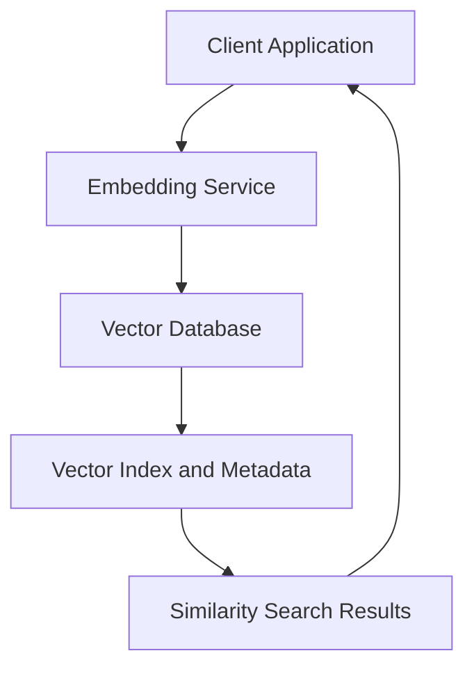

# Vector Database

## What Is a Vector Database?

A **vector database** is a specialized type of database designed to store and query **high-dimensional vectors** — typically embeddings generated from unstructured data like text, images, or audio.

Think of it as a search engine for meaning or similarity, rather than exact matches.

## Why Do We Need It?

In modern applications — think **semantic search**, **recommendation systems**, **LLM-based retrieval (RAG)** — you need to find “things like this thing.” That’s fundamentally different from relational DBs, which are great at exact matches, filters, and joins.

For example:

- Traditional SQL: “Find product with ID = 123”
- Vector DB: “Find products _similar_ to this product based on description”

## Key Concepts

### Vectors / Embeddings

- A **vector** is just a list of numbers (e.g., `[0.1, -0.3, ..., 0.05]`), often 128-1536 dimensions.
- Generated using models like OpenAI, Hugging Face Transformers, or CLIP for images.

### Similarity Search

- Vector DBs use **distance metrics** (cosine, Euclidean, dot product) to find nearest neighbors.
- “Nearest” = most semantically similar.

### Approximate Nearest Neighbor (ANN)

- Brute-force search is expensive in high dimensions (curse of dimensionality).
- ANN algorithms like **HNSW**, **FAISS**, **IVF**, and **ScaNN** make it scalable by trading off a bit of accuracy for speed.

### Indexing

- Vectors are indexed using tree structures or graphs for fast retrieval.
- Many databases support re-indexing or hybrid search (vector + keyword).

## Architecture (Simplified)


```mermaid
flowchart TD
    A[Client Application] --> B[Embedding Service]
    B --> C[Vector Database]
    C --> D[Vector Index and Metadata]
    D --> E[Similarity Search Results]
    E --> A
```

## Common Use Cases

- **RAG (Retrieval Augmented Generation)**: Combine LLMs with relevant data fetched from a vector DB.
- **Semantic Search**: Search based on meaning, not keywords.
- **Personalized Recommendations**
- **Anomaly Detection**: Find “outliers” in vector space.
- **Image/audio similarity search**

## Vector DBs in the Wild

| DB           | Key Traits                                            |
| ------------ | ----------------------------------------------------- |
| **Pinecone** | Fully managed, fast, easy to use                      |
| **Weaviate** | Open-source, includes semantic schema & hybrid search |
| **Qdrant**   | Open-source, Rust-based, efficient ANN                |
| **Milvus**   | High-performance, supports billion-scale vectors      |
| **FAISS**    | Facebook’s lib for ANN, used in many DIY solutions    |

## API Design (Typical Pattern)

```python
# Insert
client.insert([
    {
        "id": "doc1",
        "vector": [0.1, 0.2, ..., 0.05],
        "metadata": {"title": "Intro to ML"}
    }
])

# Query
results = client.query(
    vector=query_vector,
    top_k=5,
    filter={"category": "ML"}
)
```

## Integration Tips

- Use **caching** for frequently queried vectors.
- Combine vector search with **keyword filtering** for hybrid search.
- Keep metadata in sync if using a separate relational DB.
- Tune ANN parameters for the right **accuracy/speed** tradeoff.

## TL;DR for Engineers

- Vector DBs = Search by **meaning**, not exact match.
- Use when dealing with **unstructured data** (text, images, etc.).
- Embeddings → Stored in Vector DB → Queried via ANN.
- Excellent for LLM-based apps, search, recommendation systems.
- Plug into your stack like any other DB, but with an extra pre-processing step (embedding generation).

## Embedding Input Modalities & Their Applications

| **Modality**                  | **Description**                               | **Problems Solved**                                       | **Example Use Cases**                                  | **Example Embedding Models**          |
| ----------------------------- | --------------------------------------------- | --------------------------------------------------------- | ------------------------------------------------------ | ------------------------------------- |
| **Text**                      | Sentences, documents, paragraphs              | Semantic similarity, classification, search, RAG          | Search engines, chat memory, intent classification     | BERT, SBERT, OpenAI ada, Cohere, e5   |
| **Code**                      | Source code snippets, functions, entire files | Code search, clone detection, automated documentation     | GitHub Copilot, StackOverflow search, Code QA          | CodeBERT, GraphCodeBERT, OpenAI codex |
| **Image**                     | Photos, screenshots, drawings                 | Similarity, retrieval, tagging, vision-language alignment | Visual search, auto-tagging, captioning                | CLIP, ResNet, DINO, BLIP              |
| **Audio**                     | Voice clips, music, environmental sounds      | Speaker recognition, classification, retrieval            | Voice assistants, music search, bioacoustics           | Wav2Vec2, YAMNet, OpenL3              |
| **Video**                     | Sequences of frames (with/without audio)      | Action recognition, summarization, similarity             | Sports analysis, surveillance, content moderation      | VideoMAE, ViViT, CLIP-ViT             |
| **Multimodal (Text + Image)** | Joint space for language and vision           | Cross-modal search, captioning, VQA                       | Image captioning, product search ("show me red shoes") | CLIP, BLIP, Flamingo                  |
| **Multimodal (Text + Audio)** | Maps textual prompts and audio                | Sound-to-text alignment, audio search                     | Podcast search, subtitle generation                    | Whisper, CLAP                         |
| **Multilingual Text**         | Text across languages                         | Cross-lingual search, translation evaluation              | Global search, language-agnostic RAG                   | LaBSE, LASER, XLM-R                   |
| **3D Data / Point Clouds**    | Lidar, 3D object meshes                       | Object detection, shape classification                    | Robotics, autonomous vehicles, AR/VR                   | PointNet, DGCNN                       |
| **Time Series / Sensor Data** | Sequences from IoT, financial, health data    | Forecasting, anomaly detection, similarity                | Predictive maintenance, health monitoring              | TS2Vec, InceptionTime                 |
| **Tabular Data**              | Structured rows and columns                   | Classification, semantic joins, anomaly detection         | Fraud detection, semantic search in tables             | TabTransformer, FT-Transformer        |
| **Graphs**                    | Nodes + edges (social, molecular, etc.)       | Node classification, link prediction, clustering          | Social networks, drug discovery                        | Node2Vec, GCN, GraphSAGE              |
| **DNA / Protein Sequences**   | Biological sequences (genomics, proteomics)   | Functional classification, structure prediction           | Drug discovery, gene similarity                        | ESM, ProtBERT, AlphaFold embeddings   |
| **Documents (multi-modal)**   | Embedded combinations: title, body, metadata  | Hybrid retrieval, clustering, semantic linking            | Academic search, RAG pipelines                         | BGE, GTR, ColBERT                     |

### Key Takeaways

- **Text embeddings** dominate many apps, but **multimodal and structured data embeddings** are growing fast, especially in research and ML ops.
- **Multimodal embeddings** open doors for complex AI — e.g., describing an image, searching by sound, or captioning a video.
- **Biological and scientific embeddings** are a hot area in AI for science (e.g., protein folding, molecule similarity).

## Core Query Types in a Vector Database

| **Query Type**                      | **Description**                                                                                               | **Common Use Cases**                                             |
| ----------------------------------- | ------------------------------------------------------------------------------------------------------------- | ---------------------------------------------------------------- |
| **K-Nearest Neighbors (KNN)**       | Returns the top `k` vectors closest to a given query vector using a distance metric (e.g., cosine, Euclidean) | Semantic search, recommendations, RAG                            |
| **Similarity Search**               | Same as KNN, often includes a similarity **threshold** or **distance cutoff**                                 | "Find items similar to X with at least 85% similarity"           |
| **Filtered Search (Hybrid Search)** | Combines vector similarity with structured filters (metadata constraints like category, date, price)          | “Find tech blog posts similar to this one, published after 2021” |
| **Multivector / Batch Search**      | Runs multiple queries at once (e.g., batched queries)                                                         | Multi-document retrieval, LLM context building                   |
| **Score-only Search**               | Returns similarity scores (not just IDs), often for re-ranking or explainability                              | Search result tuning, A/B testing                                |
| **Reverse Lookup**                  | Given a vector, find if it already exists (or close to it) in the index                                       | Deduplication, update logic                                      |
| **Vector Arithmetic / Analogy**     | Perform operations like `vec("king") - vec("man") + vec("woman")`                                             | Word analogy tasks, embeddings reasoning (limited support)       |
| **Upsert / Replace**                | Insert or update a vector and metadata (often atomic)                                                         | Maintaining live index                                           |
| **Delete by ID or Filter**          | Remove vectors by unique ID or matching metadata                                                              | Index pruning, user data deletion                                |
| **Get by ID**                       | Retrieve the vector and/or metadata by document ID                                                            | Use in fallback pipelines or audits                              |

## Specialized / Advanced Query Modes

| **Feature**                     | **Purpose**                                             | Supported by                              |
| ------------------------------- | ------------------------------------------------------- | ----------------------------------------- |
| **Hybrid Ranking**              | Mix of keyword and vector scores                        | Weaviate, Vespa, Elasticsearch            |
| **Payload-aware Search**        | Use metadata to adjust scores or routing                | Qdrant, Weaviate                          |
| **Re-ranking (post retrieval)** | Reorder top-K using another model (e.g., cross-encoder) | Pinecone, LlamaIndex                      |
| **Geo-aware Search**            | Filter or score vectors by proximity AND location       | Milvus, custom pipelines                  |
| **Time-windowed Search**        | Filter vector results based on temporal constraints     | Pinecone (metadata filters), custom logic |

## You Can Use Embeddings Without a Vector DB

Embeddings are just **high-dimensional vectors**. You can:

- Compute them
- Store them (in memory, a file, or a traditional database)
- Compare them (e.g., cosine similarity, dot product)

### Small-scale example (no vector DB):

```python
from sklearn.metrics.pairwise import cosine_similarity

query = embed("happy")
all_vectors = [embed("joyful"), embed("sad"), embed("angry")]
similarities = cosine_similarity([query], all_vectors)

# Get top match manually
top_match = words[similarities.argmax()]
```

## Why Use a Vector Database Then?

When your dataset grows — like **thousands or millions** of vectors — comparing each one with every query becomes **slow and inefficient**.

### Vector DB gives you:

| Feature                                   | Benefit                                                    |
| ----------------------------------------- | ---------------------------------------------------------- |
| **ANN Search (Approx. Nearest Neighbor)** | Fast top-K results, even in high dimensions                |
| **Indexing & scaling**                    | Built for large-scale vector collections                   |
| **Metadata filtering**                    | Combine structured + semantic search                       |
| **Production readiness**                  | REST/gRPC APIs, high availability                          |
| **Live updates (insert/delete)**          | Good for dynamic content (e.g., user uploads)              |
| **Namespaces & filters**                  | Segment different types of embeddings (e.g., docs vs tags) |

### Vector Database Comparison

| Feature                               | **Pinecone**                                         | **Weaviate**                                        | **Qdrant**                                     | **Milvus**                                         | **FAISS**                                     |
| :------------------------------------ | :--------------------------------------------------- | :-------------------------------------------------- | :--------------------------------------------- | :------------------------------------------------- | :-------------------------------------------- |
| **Implementation Language**           | Proprietary (backend in Go + Rust)                   | Go + GraphQL + REST                                 | Rust                                           | C++ + Go (core in C++)                             | C++ (with Python bindings)                    |
| **Number of Supported Algorithms**    | Limited (proprietary ANN variants, not customizable) | Multiple (HNSW, flat, hybrid search, BM25)          | HNSW, IVF, PQ (in progress)                    | IVF, HNSW, ANNOY, DiskANN, PQ                      | Many (Flat, IVF, PQ, HNSW, LSH, custom)       |
| **Setup Complexity (Local / Docker)** | ❌ N/A – managed only                                | ⚙️ Moderate (Docker, env vars, schema setup)        | ⚙️ Easy (single Docker image, minimal config)  | ⚙️ Moderate–High (multiple services, dependencies) | 🧠 Manual (library integration, no DB server) |
| **Schema Complexity**                 | None (collection-based)                              | Complex (requires schema with data types + classes) | Simple (collections + payload schema optional) | Moderate (collection + index definitions)          | None (pure vector structures in code)         |
| **Ease of Administration**            | ⭐ Very Easy (fully managed SaaS)                    | 🧩 Medium (needs monitoring & schema mgmt)          | ✅ Easy (REST API, UI dashboard)               | ⚙️ Complex (cluster config, scaling components)    | 🧠 Developer-managed (no admin UI)            |
| **Ease of Use (Developer UX)**        | 🚀 Very High (simple API + Python client)            | 👍 High (rich clients, GraphQL/REST)                | 👍 High (Python, REST, gRPC APIs)              | ⚙️ Moderate (requires setup & config)              | 🧑‍💻 Moderate–Low (library-level use only)      |

---

### 🧩 Summary Notes

- **Pinecone** → Best for teams that want zero ops, fast production use, and SaaS simplicity.
- **Weaviate** → Great for hybrid search (semantic + keyword) and structured data.
- **Qdrant** → Lightweight, fast, Rust-based, easiest self-hosted option.
- **Milvus** → Enterprise-grade, scalable, best for billion-scale deployments.
- **FAISS** → Excellent for research or embedded use, not a standalone service.

## SimpleVectorStore vs Qdrant

| **Feature**                          | **SimpleVectorStore**                                                  | **Qdrant** _(adds / extends)_                                                                     |
| :----------------------------------- | :--------------------------------------------------------------------- | :------------------------------------------------------------------------------------------------ |
| **Storage & Persistence Model**      | In-memory dictionary, optionally persisted to disk via a JSON file.    | Full vector database with on-disk persistence, efficient storage, and memory-mapped IO.           |
| **Scale & Performance**              | Suitable for small datasets or prototypes; no specialized indexing.    | Designed for large-scale, high-performance vector search with optimized indexes and caching.      |
| **Indexing / Search Algorithms**     | Brute-force or simple cosine similarity search only.                   | Advanced ANN algorithms (HNSW, IVF, PQ), multiple distance metrics, hybrid and quantized indexes. |
| **Metadata / Payload Filtering**     | Limited; simple metadata may be stored but not indexed for filtering.  | Rich payload/metadata filtering with indexed fields and conditional filters.                      |
| **Hybrid (Sparse + Dense) Search**   | Dense vectors only; no hybrid capabilities.                            | Supports hybrid search combining dense and sparse (keyword) representations.                      |
| **Filtering / Query Richness**       | Basic top-k similarity search; minimal filtering.                      | Complex filtering logic (AND/OR/NOT), faceting, and multi-field conditions.                       |
| **Deployment / Operations**          | Runs locally within Python; zero configuration, not production-grade.  | Production-ready DB with Docker deployment, clustering, sharding, and replication.                |
| **Distance Metrics / Customization** | Typically cosine similarity only; little customization.                | Multiple metrics (cosine, Euclidean, dot, Manhattan) and index tuning parameters.                 |
| **Persistence & Data Management**    | Can persist to a JSON file, but not optimized for very large datasets. | Efficient, durable on-disk storage with background indexing, updates, and deletions.              |
| **Insert / Update / Delete Support** | Basic operations; not scalable for millions of entries.                | Full CRUD operations with high performance and near real-time updates.                            |
| **Observability / Admin Tools**      | None; operates as a lightweight in-memory store.                       | Provides REST API, Web UI dashboard, metrics, and integration with monitoring tools.              |

---

### Summary: When Qdrant adds value

- If you are simply prototyping or running small scale (< 10K‐100K vectors) retrieval tasks, the SimpleVectorStore may suffice.
- But if you anticipate: many millions of vectors, need for fast query latency, metadata filtering, hybrid search (dense + sparse), custom distance metrics, deployment in production with scaling & fault-tolerance — then moving to Qdrant (or another production-grade vector DB) makes a lot of sense.
- The gaps filled by Qdrant are primarily in **scale, performance, deployment & operational robustness, advanced query/filtering capabilities**, rather than just “store some embeddings and query them”.

| Input                                  | Meaning                                       | Drives                         |
| :------------------------------------- | :-------------------------------------------- | :----------------------------- |
| **Dense vectors (number + dimension)** | Count and length of your embeddings           | Core memory & disk use         |
| **Sparse vectors (number + elements)** | Number of sparse embeddings and their density | Extra memory for hybrid search |
| **Payload indexes**                    | Optional structured metadata                  | Indexing overhead              |

## Dense vs. Sparse Vector Models — Comparison Overview

| **Model / Provider**                        | **Type**                    |     **Dimensionality**      | **Typical # of Vectors** |     **# of Elements per Vector**     | **Open Source / Paid** | **Typical Usage / Description**                                              |
| :------------------------------------------ | :-------------------------- | :-------------------------: | :----------------------: | :----------------------------------: | :--------------------- | :--------------------------------------------------------------------------- |
| **OpenAI `text-embedding-3-small`**         | Dense                       |            1,536            |         10³–10⁷          | 1,536 (dense: every dim has a value) | Paid (OpenAI API)      | General-purpose text embeddings for semantic search, retrieval, or RAG.      |
| **OpenAI `text-embedding-3-large`**         | Dense                       |            3,072            |         10³–10⁷          |                3,072                 | Paid                   | High-accuracy semantic representation for large-scale retrieval and ranking. |
| **Cohere `embed-english-v3.0`**             | Dense                       |            1,024            |         10³–10⁷          |                1,024                 | Paid                   | Strong for English semantic similarity, RAG, document search.                |
| **SentenceTransformers `all-MiniLM-L6-v2`** | Dense                       |             384             |         10³–10⁶          |                 384                  | Open Source            | Lightweight model for semantic text similarity, FAQs, and clustering.        |
| **InstructorXL (HuggingFace)**              | Dense                       |             768             |         10³–10⁶          |                 768                  | Open Source            | Embeddings guided by task-specific instructions; good for retrieval tasks.   |
| **CLIP (OpenAI / LAION)**                   | Dense                       |             512             |         10⁵–10⁷          |                 512                  | Open Source            | Multimodal embeddings (image–text similarity, search, classification).       |
| **Google Universal Sentence Encoder**       | Dense                       |             512             |         10³–10⁶          |                 512                  | Free / Open API        | Sentence-level semantic embeddings for text classification or similarity.    |
| **BM25 / TF-IDF (e.g., Elasticsearch)**     | Sparse                      |     varies (~50K vocab)     |         10³–10⁸          |        50–300 non-zero terms         | Open Source            | Classic keyword-based retrieval; sparse vector per document/token frequency. |
| **SPLADE / SPLADE++ (HuggingFace)**         | Sparse                      |    30K–100K (vocab size)    |         10³–10⁷          |        50–300 non-zero terms         | Open Source            | Neural sparse retriever; combines semantic power and interpretability.       |
| **ColBERT / ColBERTv2**                     | Hybrid (multi-vector dense) |      128–768 per token      |         10³–10⁶          |    Variable (~50 vectors per doc)    | Open Source            | Dense per-token embeddings for late-interaction retrieval.                   |
| **OpenAI Hybrid (dense + keyword)**         | Dense + Sparse              |    1,536 + sparse terms     |         10³–10⁷          |                varies                | Paid                   | Hybrid retrieval combining semantic and keyword signals.                     |
| **Qdrant Example (dense + sparse hybrid)**  | Both                        | 768 dense + variable sparse |         10⁵–10⁷          |       100–500 sparse elements        | Open Source            | Example hybrid vector store setup in Qdrant or Weaviate for RAG pipelines.   |

---

### 🧩 Notes

- **Dense vectors**: Every element represents a learned numerical feature (no zeros). Memory = `#vectors × dimension × 4 bytes`.
- **Sparse vectors**: Mostly zeros; only nonzero elements (word features) are stored, reducing space and improving interpretability.
- **Hybrid search**: Combines dense semantic and sparse lexical signals for more accurate retrieval (supported by Qdrant, Weaviate, etc.).
- **Typical scales**:

  - Small projects: 10³–10⁴ vectors
  - Medium apps / internal RAG: 10⁵–10⁶
  - Enterprise-scale search: 10⁷–10⁹
